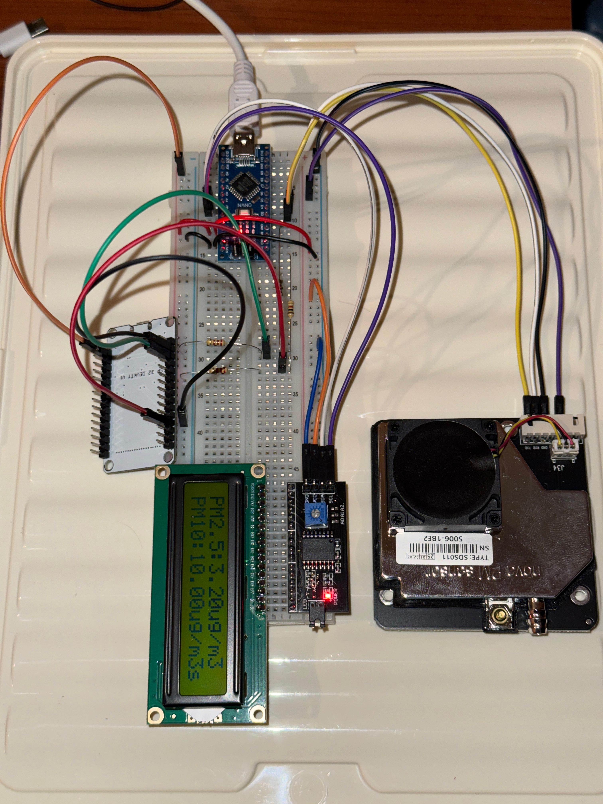
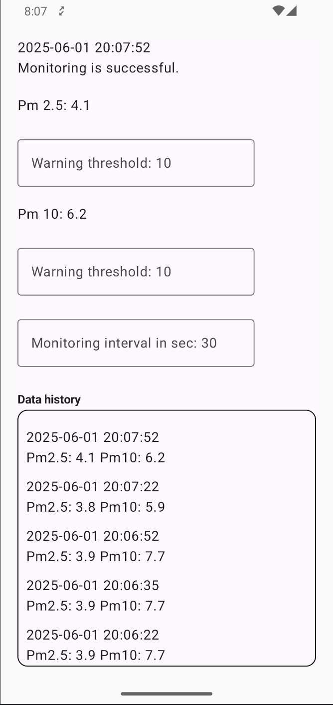

# Arduino Air Quality Monitor with ESP32 and Android App

## Overview

This project is a complete air quality monitoring system that measures particulate matter (PM2.5 and PM10) using an SDS011 sensor, displays the results on an LCD, transmits the data via an ESP32 microcontroller, and provides real-time monitoring and notifications through a modern Android application.

**Main Components:**
- **Arduino**: Reads data from the SDS011 sensor and displays it on an LCD.
- **ESP32**: Receives data from Arduino, serves it over WiFi as a JSON API.
- **Android App**: Connects to the ESP32, displays air quality data, and notifies the user if thresholds are exceeded.

---

<div align="center">
 
</div>

___

## Table of Contents

- [Features](#features)
- [Architecture](#architecture)
- [Hardware Requirements](#hardware-requirements)
- [Setup Guide](#setup-guide)
  - [Arduino](#arduino-setup)
  - [ESP32](#esp32-setup)
  - [Android App](#android-app-setup)
- [Usage](#usage)
- [Customization](#customization)
- [Documentation](#documentation)

---

## Features

- **Real-time PM2.5 and PM10 monitoring**
- **LCD display for local readings**
- **WiFi-enabled ESP32 web server (JSON API)**
- **Android app with live data, threshold configuration, and notifications**
- **Customizable measurement intervals and thresholds**
- **Open-source and modular design**

---

## Architecture

```
[SDS011 Sensor] --UART--> [Arduino] --Serial+Signal--> [ESP32] --WiFi--> [Android App]
                              |                           |                    |
                        [LCD Display]                [Web Server]       [Notifications]
```

- **Arduino**: Reads sensor data, displays it, and signals ESP32 when new data is ready.
- **ESP32**: Waits for data-ready signal, reads serial data, and serves it via HTTP (JSON and HTML).
- **Android App**: Periodically fetches data from ESP32, displays it, and notifies the user.

---

## Hardware Requirements

- Arduino board (Uno, Nano, etc.)
- ESP32 development board
- SDS011 particulate matter sensor
- 16x2 I2C LCD display
- Jumper wires, breadboard, power supply

---

## Setup Guide

### Arduino Setup

1. **Wiring:**
   - Connect the SDS011 sensor to the Arduino using UART.
   - Connect the LCD display via I2C.
   - Connect a digital output pin to the ESP32 as a data-ready signal.

2. **Flashing:**
   - Open `arduino/arduino.ino` in the Arduino IDE.
   - Install required libraries: `SoftwareSerial`, `LiquidCrystal_I2C`, `TimeLib`.
   - Upload the sketch to your Arduino.

3. **Functionality:**
   - The Arduino reads PM2.5 and PM10 values, displays them, and sends them to the ESP32 when ready.

### ESP32 Setup

1. **Wiring:**
   - Connect the ESP32 to the Arduino’s serial TX/RX and the data-ready signal pin.

2. **Flashing:**
   - Open `esp32/esp32.ino` in the Arduino IDE or PlatformIO.
   - Create a `Credentials.h` file with your WiFi SSID and password:
     ```cpp
     const char* ssid = "YOUR_WIFI_SSID";
     const char* password = "YOUR_WIFI_PASSWORD";
     ```
   - Upload the sketch to your ESP32.

3. **Functionality:**
   - The ESP32 connects to WiFi, listens for the data-ready signal, reads serial data from Arduino, and serves it at `http://<ESP32_IP>/json`.

### Android App Setup

1. **Requirements:**
   - Android Studio (latest version)
   - Android device or emulator

2. **Building:**
   - Open the `AirQualityMonitorAndroidApp` directory in Android Studio.
   - Update the base URL in `Module.kt` if your ESP32 uses a different IP.
   - Build and run the app on your device.

3. **Functionality:**
   - The app fetches air quality data from the ESP32, displays it, and notifies the user if thresholds are exceeded.
   - Users can set custom thresholds and monitoring intervals.

<div align="center">
 
</div>

---

## Usage

- Power on the Arduino and ESP32. Ensure both are connected and the ESP32 is on the same WiFi network as your Android device.
- Launch the Android app. It will automatically start monitoring and display the latest PM2.5 and PM10 values.
- Set your preferred thresholds and monitoring interval in the app.
- Receive notifications if air quality exceeds your set limits.

---

## Customization

- **Thresholds and Intervals:** Adjustable in the Android app.
- **WiFi Credentials:** Set in `esp32/Credentials.h`.
- **Sensor Pins:** Change in `arduino/arduino.ino` and `esp32/esp32.ino` as needed.
- **API Endpoint:** Update the base URL in the Android app’s `Module.kt`.

---

## Documentation

- **SDS011 Sensor Protocol:** See `docs/SDS011_Control_Protocol.pdf` and `docs/SDS011-DATASHEET.pdf`.
- **LCD Display Datasheet:** See `docs/TC1602D-02WB0_A00.pdf`.
- **Code Structure:**
  - `arduino/`: Arduino firmware and sensor handling.
  - `esp32/`: ESP32 firmware for WiFi and web server.
  - `AirQualityMonitorAndroidApp/`: Android app source code.
  - `docs/`: Datasheets and protocol documentation.

---


**For questions or contributions, please open an issue or pull request on the repository.**
